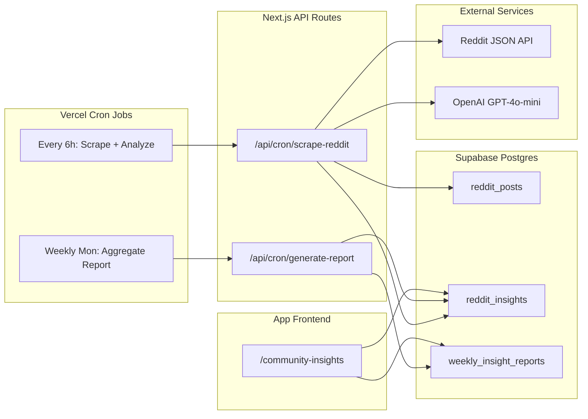

# Reddit Community Insights Automation for PainMap

## Overview

Build an automated pipeline that scrapes r/Sciatica posts, uses OpenAI to extract pain triggers and relief factors, stores them in Supabase, and presents aggregated weekly insights on a new in-app page — gated behind auth for future monetization.

## Architecture Overview



---

## 1. Reddit Data Collection (No API key needed)

Reddit exposes public JSON endpoints for any subreddit. We fetch new posts using:

```
https://www.reddit.com/r/Sciatica/new.json?limit=100
```

- No OAuth or API keys required for read-only public data
- Pagination via `after` parameter for catching up on missed posts
- Store `post_id` to avoid re-processing duplicates
- Fetch both title + selftext (body) for analysis
- Also fetch top-level comments for richer signal (posts often have relief tips in replies)

**Rate limit consideration**: Reddit allows ~10 req/min for unauthenticated access. We only need 1-2 requests per cron run, so this is fine.

---

## 2. New Supabase Tables

### `reddit_posts`

- **id** (uuid, PK) — Internal ID
- **reddit_id** (text, unique) — Reddit post fullname (e.g., t3_abc123)
- **title** (text) — Post title
- **body** (text) — Post selftext
- **author** (text) — Reddit username
- **url** (text) — Full Reddit URL
- **score** (int) — Upvotes
- **num_comments** (int) — Comment count
- **reddit_created_at** (timestamptz) — When posted on Reddit
- **scraped_at** (timestamptz) — When we scraped it
- **analyzed** (boolean) — Whether OpenAI has processed it

### `reddit_insights`

- **id** (uuid, PK) — Internal ID
- **post_id** (uuid, FK -> reddit_posts) — Source post
- **insight_type** (text) — `pain_trigger` or `relief_factor`
- **category** (text) — Normalized category (e.g., "exercise", "medication", "posture")
- **detail** (text) — Specific detail (e.g., "walking 30 min", "gabapentin", "standing desk")
- **sentiment** (text) — `positive`, `negative`, `neutral`
- **mentions** (int) — Default 1, incremented during aggregation
- **created_at** (timestamptz) — Extraction time

### `weekly_insight_reports`

- **id** (uuid, PK) — Internal ID
- **week_start** (date) — Monday of the week
- **week_end** (date) — Sunday of the week
- **total_posts_analyzed** (int) — Count of posts in this window
- **top_pain_triggers** (jsonb) — Ranked list of pain triggers with counts
- **top_relief_factors** (jsonb) — Ranked list of relief factors with counts
- **trending_topics** (jsonb) — New/rising mentions vs prior week
- **summary** (text) — AI-generated natural language summary
- **created_at** (timestamptz) — Report generation time

**No RLS needed** on these tables — the data is scraped from public Reddit posts and is not user-specific. Access is gated at the API/page level via auth middleware.

---

## 3. New Dependencies

- `openai` — Official OpenAI Node.js SDK for GPT-4o-mini calls

---

## 4. New Environment Variables

```
OPENAI_API_KEY=sk-...
CRON_SECRET=<random-string>   # Vercel cron authorization
```

The `CRON_SECRET` protects cron API routes from being called by anyone other than Vercel's cron scheduler.

---

## 5. API Routes (Cron Endpoints)

### `app/api/cron/scrape-reddit/route.ts`

- **Trigger**: Vercel cron every 6 hours
- **Auth**: Verify `CRON_SECRET` header
- **Flow**:
  1. Fetch latest ~100 posts from `r/Sciatica/new.json`
  2. Filter out posts already in `reddit_posts` (by `reddit_id`)
  3. Insert new posts into `reddit_posts`
  4. For each unanalyzed post, call OpenAI GPT-4o-mini with a structured extraction prompt
  5. Insert extracted insights into `reddit_insights`
  6. Mark posts as `analyzed = true`

**OpenAI Prompt Strategy**: Send post title + body to GPT-4o-mini with a system prompt asking it to return structured JSON:

```json
{
  "pain_triggers": [
    { "category": "activity", "detail": "sitting for 8 hours", "confidence": 0.9 }
  ],
  "relief_factors": [
    { "category": "exercise", "detail": "McKenzie extensions", "confidence": 0.95 }
  ]
}
```

Categories will be normalized to a fixed taxonomy: `activity`, `posture`, `exercise`, `medication`, `supplement`, `therapy`, `lifestyle`, `sleep`, `stress`, `diet`, `weather`, `surgery`, `injection`, `other`.

### `app/api/cron/generate-report/route.ts`

- **Trigger**: Vercel cron every Monday at 8 AM UTC
- **Auth**: Verify `CRON_SECRET` header
- **Flow**:
  1. Query `reddit_insights` for the past 7 days
  2. Aggregate by category + detail, rank by frequency
  3. Compare with previous week for trending detection
  4. Call OpenAI to generate a natural language summary paragraph
  5. Insert into `weekly_insight_reports`

---

## 6. Vercel Cron Configuration

Update `vercel.json`:

```json
{
  "framework": "nextjs",
  "installCommand": "yarn install",
  "crons": [
    {
      "path": "/api/cron/scrape-reddit",
      "schedule": "0 */6 * * *"
    },
    {
      "path": "/api/cron/generate-report",
      "schedule": "0 8 * * 1"
    }
  ]
}
```

---

## 7. Frontend: `/community-insights` Page

A new authenticated page at `app/community-insights/page.tsx` with:

- **Weekly Report Card**: Latest report summary, date range, post count
- **Top Pain Triggers**: Ranked bar chart (using existing Recharts) showing most-mentioned triggers
- **Top Relief Factors**: Ranked bar chart showing most-mentioned relief methods
- **Trending This Week**: Tags/badges showing what's newly trending vs. prior week (up/down arrows)
- **Historical Reports**: Dropdown or list to view past weeks
- **Navigation**: Add a new nav item ("Community Insights" with a `Users` or `Globe` icon) to the bottom nav bar

Data fetching follows the existing pattern: server component for initial fetch via `lib/data/` functions, hydrated into React Query on the client for interactivity.

---

## 8. New Files Summary

- `app/api/cron/scrape-reddit/route.ts` — Cron: scrape Reddit + analyze with OpenAI
- `app/api/cron/generate-report/route.ts` — Cron: aggregate weekly report
- `app/community-insights/page.tsx` — Page: server component wrapper
- `components/pages/CommunityInsights.tsx` — Client component: insights UI
- `components/community-insights/WeeklyReportCard.tsx` — Report summary card
- `components/community-insights/InsightsChart.tsx` — Bar charts for triggers/relief
- `components/community-insights/TrendingBadges.tsx` — Trending items display
- `lib/data/reddit-insights.ts` — Data fetching functions (server-side)
- `lib/reddit/scraper.ts` — Reddit JSON API fetching logic
- `lib/reddit/analyzer.ts` — OpenAI analysis logic
- `types/reddit.ts` — TypeScript types for Reddit data

---

## 9. Cost Estimate

- **OpenAI GPT-4o-mini**: ~$0.15/1M input tokens, ~$0.60/1M output tokens. Analyzing ~100 posts/day with ~500 tokens each = ~$0.01/day = **under $1/month**
- **Vercel Cron**: Free on Hobby plan (up to daily), Pro plan for more frequent runs
- **Supabase**: Well within free tier for this volume

---

## 10. Future Monetization Hook

This feature is auth-gated from day one. Potential Pro-tier restrictions:

- Free users: see only the latest week's summary
- Pro users: full history, trending analysis, detailed breakdowns, export

---

## Implementation Order

1. Create Supabase migration for `reddit_posts`, `reddit_insights`, and `weekly_insight_reports` tables
2. Build Reddit JSON API scraper module (`lib/reddit/scraper.ts`) with pagination and dedup
3. Build OpenAI analysis module (`lib/reddit/analyzer.ts`) with structured extraction prompt
4. Create `/api/cron/scrape-reddit` route with `CRON_SECRET` auth, wiring scraper + analyzer
5. Create `/api/cron/generate-report` route for weekly aggregation and AI summary
6. Update `vercel.json` with cron schedules (every 6h scrape, weekly Monday report)
7. Add server-side data fetching functions in `lib/data/reddit-insights.ts`
8. Build `/community-insights` page with report cards, Recharts bar charts, and trending badges
9. Add Community Insights to the bottom navigation bar
10. Add `OPENAI_API_KEY` and `CRON_SECRET` to environment variables and `.env.example`
